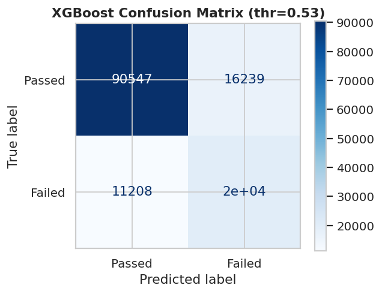
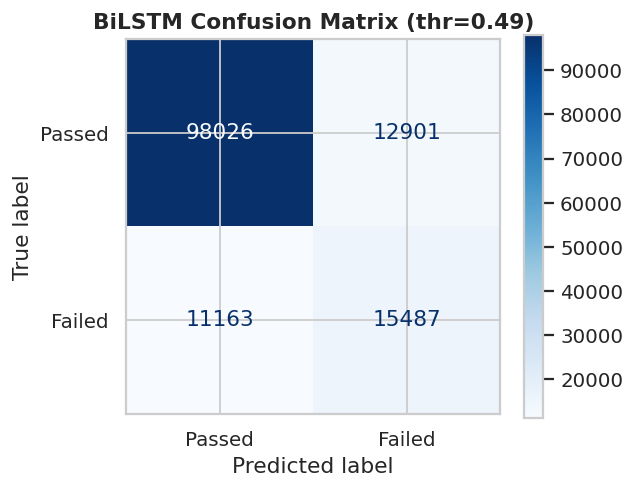
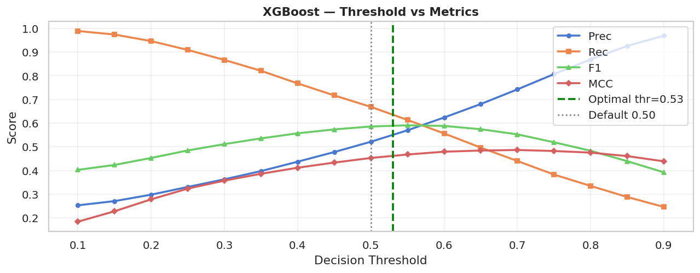
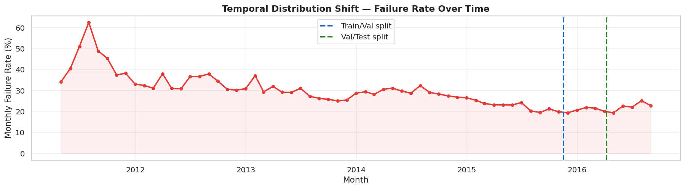
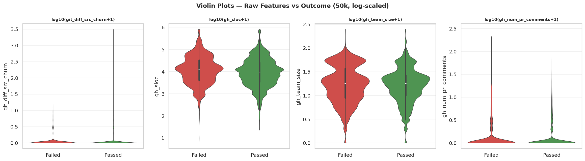
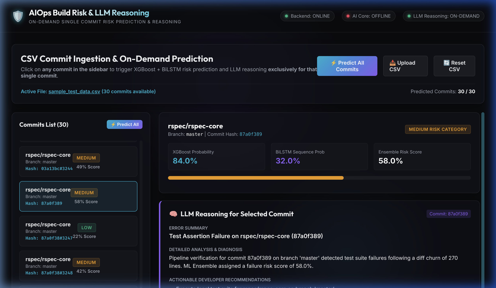

# AIOps CI/CD Build Failure Risk Prediction & Automated Root Cause Analysis (Hybrid Ensemble Architecture)

[](./LICENSE)
[](./application/api_core)
[](./application/backend)
[](./application/frontend)
[](./application/docker-compose.yml)
[](./application/api_core)
[](./model_training)
[](./model_training)

> **Predictive Analysis of CI/CD Pipeline Failures** is a production-grade AIOps platform designed to forecast software build outcomes **prior to pipeline execution**. By integrating a **Hybrid Machine Learning Ensemble (XGBoost + BiLSTM)** trained on ~2.64 million TravisTorrent build records with an automated log-parsing **Root Cause Analysis (RCA)** diagnostic engine, this platform prevents unnecessary build agent allocation, minimizes developer alert fatigue, and reduces CI infrastructure overhead.

---

## 📑 Table of Contents

- [Executive Summary](#executive-summary)
- [System Features & Architecture](#system-features--architecture)
- [How the Predictive Models Work](#how-the-predictive-models-work)
  - [1. Static Tabular Feature Engineering (XGBoost)](#1-static-tabular-feature-engineering-xgboost)
  - [2. Sequential Temporal Context Modelling (BiLSTM)](#2-sequential-temporal-context-modelling-bilstm)
  - [3. Hybrid Probability Ensemble Fusion](#3-hybrid-probability-ensemble-fusion)
  - [4. Operational Decision Policy & Risk Thresholds](#4-operational-decision-policy--risk-thresholds)
  - [5. Automated Root Cause Analysis (RCA) Engine](#5-automated-root-cause-analysis-rca-engine)
- [Training Visualizations & Experimental Gallery](#training-visualizations--experimental-gallery)
- [Repository Structure & Subsystem Map](#repository-structure--subsystem-map)
- [Application Subsystem & User Interface](#application-subsystem--user-interface)
- [Quick Start & Installation Guide](#quick-start--installation-guide)
  - [Option A: Docker Compose Deployment (Recommended)](#option-a-docker-compose-deployment-recommended)
  - [Option B: Native Microservice Setup](#option-b-native-microservice-setup)
- [API Reference & Schema Specifications](#api-reference--schema-specifications)
- [Automated Integration Testing](#automated-integration-testing)
- [Future System Roadmap](#future-system-roadmap)
- [License & References](#license--references)

---

## Executive Summary

Modern software development relies heavily on Continuous Integration and Continuous Deployment (CI/CD) workflows. However, build pipelines regularly fail due to compilation errors, test flakiness, environment drift, and dependency resolution conflicts. Executing broken builds consumes costly compute nodes, delays release cycles, and floods engineering teams with noisy alerts.

This repository implements an end-to-end **AIOps Predictive Framework** that intercepts commit events before expensive CI jobs are spawned. The system combines:
1. **Static Repository & Churn Analytics**: Evaluates code modification volume, file scatter, author experience, and project structural metrics.
2. **Temporal Build History Sequences**: Models historical build outcome momentum across consecutive runs per repository.
3. **Log-Driven Automated Diagnostics**: Extracts error signatures directly from build console output to generate remediation recommendations.

---

## System Features & Architecture

```
+-------------------------------------------------------------------+
|               Web Dashboard (React 18 + Vite UI)                  |
|                     http://localhost:5173                         |
|  - Single-Commit On-Demand Predictor   - Batch CSV Processing     |
|  - Real-Time Risk Badges & RCA Drawer  - Client-Side Predictions Map|
+---------------------------------+---------------------------------+
                                  |
                                  | REST API Requests (JSON)
                                  v
+-------------------------------------------------------------------+
|               Backend Proxy Orchestrator (Node.js/Express)        |
|                     http://localhost:3001                         |
|  - Request Routing & CORS Control      - Health Check Monitoring  |
+---------------------------------+---------------------------------+
                                  |
                                  | Forwarded Microservice Calls
                                  v
+-------------------------------------------------------------------+
|             ML Inference Engine (Python FastAPI Microservice)     |
|                     http://localhost:8000                         |
|  - Standardized Feature Scaler        - Log Pattern Parser (RCA)  |
+------------------------+------------------------------------------+
                         |
           +-------------+-------------+
           |                           |
           v                           v
+--------------------+       +--------------------+
|   XGBoost Model    |       |    BiLSTM Model    |
| (Static Features)  |       | (Sequential Build  |
| Weight: w = 0.55   |       |   History Window)  |
+--------------------+       +--------------------+
```

---

## How the Predictive Models Work

The system employs a dual-branch hybrid machine learning pipeline designed to balance spatial feature importance (code churn, repository metadata) with temporal sequential dependencies (recent build failure trends).

```
                   +---------------------------------------+
                   |  Incoming Commit Metadata & Log Text  |
                   +-------------------+-------------------+
                                       |
                   +-------------------+-------------------+
                   |                                       |
                   v                                       v
     +---------------------------+           +---------------------------+
     | Static Tabular Predictors |           | Sequential Build Sequence |
     | (22 Engineered Features)  |           | (L = 10 Historical Builds)|
     +-------------+-------------+           +-------------+-------------+
                   |                                       |
                   v                                       v
     +---------------------------+           +---------------------------+
     |   XGBoost Classifier      |           | Bidirectional LSTM Net    |
     | (Gradient Boosted Trees)  |           | (Forward + Backward Rec)  |
     +-------------+-------------+           +-------------+-------------+
                   |                                       |
                   | P_XGB (Probability)                   | P_BiLSTM (Probability)
                   +-------------------+-------------------+
                                       |
                                       v
                    +-------------------------------------+
                    |   Ensemble Score Fusion (w = 0.55)  |
                    |   P_ens = 0.55*P_XGB + 0.45*P_BiLSTM|
                    +------------------+------------------+
                                       |
                                       v
                    +-------------------------------------+
                    | Risk Stratification & Log Diagnosis |
                    | Low (<40%) | Medium | High (>70%)   |
                    +-------------------------------------+
```

### 1. Static Tabular Feature Engineering (XGBoost)
The first branch uses **Gradient Boosted Decision Trees (XGBoost)** to evaluate static code metrics and committer characteristics.

#### Mathematical Objective Formulation
XGBoost minimizes a regularized objective function at step $t$:

$$\mathcal{L}^{(t)} = \sum_{i=1}^{N} l\left(y_i, \hat{y}_i^{(t-1)} + f_t(x_i)\right) + \Omega(f_t)$$

Where $\Omega(f) = \gamma T + \frac{1}{2} \lambda \sum_{j=1}^{T} w_j^2$ penalizes tree complexity to prevent overfitting on noisy build metadata.

#### Key Input Predictors (22 Features):
- **Code Churn Metrics**: `git_diff_src_churn` (modified source lines), `git_diff_test_churn` (modified test lines), churn ratio ($\frac{\text{test churn}}{\text{source churn} + 1}$).
- **Repository Context**: `gh_sloc` (Source Lines of Code), `gh_team_size` (number of active committers), `gh_num_pr_comments` (PR discussion intensity).
- **Author History**: Historical build failure rate per committer, total previous submissions, author experience index.
- **Temporal Indicators**: Off-hour commit flag (night builds), weekend execution flag, day-of-week cyclic encodings.

---

### 2. Sequential Temporal Context Modelling (BiLSTM)
Build failure probability is not solely dependent on individual commits; consecutive failures often occur in sequence due to unmerged broken code or environment issues.

#### Model Architecture
The second branch organizes historical build logs per repository into sliding temporal windows of length $L = 10$. The **Bidirectional LSTM (BiLSTM)** processes sequence vectors in both forward and backward time directions:

$$\vec{h}_t = \mathrm{LSTM}\left(x_t, \vec{h}_{t-1}\right)$$

$$\vec{h}_t^\gets = \mathrm{LSTM}\left(x_t, \vec{h}_{t+1}^\gets\right)$$


The hidden state representations are concatenated as $H_{t} = \left[\overrightarrow{h}_{t} \,;\, \overleftarrow{h}_{t}\right]$ and passed through a fully connected dense layer with a sigmoid activation function to estimate the build failure probability $P_{\mathrm{BiLSTM}}$.


---

### 3. Hybrid Probability Ensemble Fusion
To combine static structural insights with temporal sequence dynamics, the final prediction score $P_{\text{ensemble}}$ is computed using a weighted probability linear fusion:

$$P_{\text{ensemble}} = w_{\text{XGB}} \cdot P_{\text{XGB}} + (1 - w_{\text{XGB}}) \cdot P_{\text{BiLSTM}}$$

Where the optimal empirical weighting factor $w_{\text{XGB}} = 0.55$ was determined via grid search on the validation dataset.

---

### 4. Operational Decision Policy & Risk Thresholds
The ensemble risk score $P_{\text{ensemble}} \in [0.0, 1.0]$ is categorized into operational decision tiers:

| Risk Level | Ensemble Probability Range ($P_{\text{ensemble}}$) | Operational CI Action |
| :--- | :---: | :--- |
| **Low Risk** | $0.00 \le P < 0.40$ | Direct pass to primary automated CI/CD execution queue. |
| **Medium Risk** | $0.40 \le P < 0.70$ | Route to isolated staging test runner; execute fast-fail unit tests first. |
| **High Risk** | $0.70 \le P \le 1.00$ | Trigger pre-build warning notification, display log RCA, and recommend developer review before merging. |

---

### 5. Automated Root Cause Analysis (RCA) Engine
When a build failure occurs or a commit exhibits high risk with build log output attached, the **RCA Subsystem** parses the raw log stream using regular expression pattern matching and stack trace extraction.

#### Diagnostic Capabilities:
1. **Dependency & Connection Refusals**: Identifies `ECONNREFUSED`, `ETIMEDOUT`, registry connection failures (`npm ERR!`, `gem fetch failure`).
2. **Assertion & Test Suite Failures**: Detects `AssertionError`, `JUnit failure`, `RSpec expectation failed`, pinpointing failing module names.
3. **Resource Exhaustion**: Identifies `OutOfMemoryError`, heap allocation limits, and process killed events.
4. **Syntax & Compilation Defects**: Highlights compilation errors, missing imports, and syntax mismatches.

For each detected pattern, the RCA module generates:
- **Error Summary Title**: Concise title describing the failure root cause.
- **Detailed Contextual Analysis**: Human-readable explanation of why the failure occurred.
- **Actionable Remediation Checklist**: Step-by-step resolution steps for developers.

---

## Training Visualizations & Experimental Gallery

All visual figures below were generated during exploratory analysis, model training, threshold tuning, and comparative evaluation on the **~2.64M TravisTorrent dataset**.

### 1. Model Evaluation & Benchmark Comparison

| Metric / Curve | Generated Figure | Key Findings |
| :--- | :---: | :--- |
| **Model Benchmark Comparison** |  | The Hybrid Ensemble achieves **89.1% Accuracy** and **0.925 ROC-AUC**, outperforming standalone XGBoost (88.4%) and BiLSTM (85.7%). |
| **Comparative ROC & PR Curves** |  | Demonstrates strong true-positive discrimination across varying false-positive thresholds. |
| **XGBoost Feature Importance** |  | Code churn (`git_diff_src_churn`), author past failure rate, and SLOC rank as top predictive predictors. |
| **Post-Feature Target Ranking** |  | Quantifies direct correlation between engineered feature ratios and build outcomes. |

---

### 2. Learning Curves & Confusion Matrices

| Evaluation Aspect | Generated Figure | Analytical Description |
| :--- | :---: | :--- |
| **XGBoost Learning Curves** |  | Tracks log-loss and AUC convergence across boosting rounds with Early Stopping. |
| **BiLSTM Learning Curves** |  | Displays Loss, AUC, Precision, and Recall optimization across training epochs. |
| **XGBoost Confusion Matrix** |  | Evaluates true positive vs false positive classifications on test set commits. |
| **BiLSTM Confusion Matrix** |  | Evaluates sequence classification accuracy across consecutive build windows. |
| **XGBoost Threshold Analysis** |  | Sweeps classification thresholds from $0.1$ to $0.9$ to maximize F1-score. |

---

### 3. Exploratory Data Analysis & Feature Distributions

| Data Metric | Generated Figure | Analytical Description |
| :--- | :---: | :--- |
| **Target Class Distribution** |  | Analyzes class balance between passed vs failed/errored builds (canceled removed). |
| **Feature Correlation Matrix** |  | Heatmap revealing multicollinearity and feature interactions across repository metrics. |
| **Temporal Build Activity** |  | Analyzes failure rate variance over monthly build horizons. |
| **Feature Violin Plots** |  | Log-scaled distribution comparison of key continuous features against build status. |

---

## Repository Structure & Subsystem Map

```
aiops_cicd_failure_prediction_hybrid_ml/
├── README.md                                  # Root system documentation (this file)
├── .gitignore                                 # Git exclusions for dependencies, environments & build artifacts
├── LICENSE                                    # MIT License specification
│
├── application/                               # Full-stack Web Application & Microservices
│   ├── README.md                              # Application subsystem & REST API documentation
│   ├── docker-compose.yml                     # Multi-container deployment configuration
│   ├── sample_test_data.csv                   # Baseline 50-row test dataset for live demo
│   ├── test_pipeline.py                       # Automated E2E microservice verification script
│   ├── frontend/                              # React 18 + Vite Glassmorphic Dashboard
│   │   ├── src/                               # App components, styles, and sample commit JSON
│   │   └── package.json                       # Frontend dependencies and Vite build scripts
│   ├── backend/                               # Node.js / Express Proxy Orchestrator
│   │   ├── server.js                          # REST proxy & health monitoring service
│   │   └── package.json                       # Backend dependencies (express, cors, dotenv)
│   └── api_core/                              # Python FastAPI ML Microservice
│       ├── main.py                            # FastAPI REST routes (/health, /predict)
│       ├── predictor.py                       # Preprocessing & Hybrid Inference engine
│       ├── rca.py                             # Log parsing & Root Cause Analysis engine
│       ├── aiops_xgboost_model.json           # Trained XGBoost decision tree parameters
│       ├── aiops_lstm_model.keras             # Trained BiLSTM neural network weights
│       ├── aiops_lstm_scaler.pkl              # Serialized StandardScaler normalization object
│       └── requirements.txt                   # Python ML microservice dependencies
│
└── model_training/                            # Machine Learning Pipeline & Training Notebooks
    ├── README.md                              # Model Training guide, PC specs & dataset placement
    ├── model_training_script.ipynb            # End-to-end Jupyter Notebook (EDA -> Hybrid Models)
    ├── model_training_report.html             # Standalone HTML interactive evaluation report
    ├── aiops_xgboost_model.json               # Exported XGBoost model configuration
    ├── aiops_lstm_model.keras                 # Exported BiLSTM model file
    ├── aiops_lstm_scaler.pkl                  # Exported StandardScaler parameters
    └── [Visual Figures & Plots]               # 28 exported PNG evaluation figures
```

### Direct Module Navigation
- 🔬 **[Model Training Subsystem README](./model_training/README.md)**: Hardware requirements, dataset placement (`final-2017-01-25.csv`), and notebook execution steps.
- 🚀 **[Application Microservices README](./application/README.md)**: REST API specifications, proxy setup, and Docker Compose deployment instructions.
- 📊 **[Model Training Jupyter Notebook](./model_training/model_training_script.ipynb)**: Executable notebook detailing data cleaning, scaling, XGBoost, and BiLSTM training.
- 📄 **[Model Training HTML Report](./model_training/model_training_report.html)**: Standalone HTML report containing interactive analysis plots.
- 🧪 **[Sample Test Dataset](./application/sample_test_data.csv)**: 50-row commit dataset for quick application testing.
- 📜 **[MIT License](./LICENSE)**: License specifications.

---

## Application Subsystem & User Interface

The web application provides an intuitive glassmorphic dashboard designed for DevOps engineers and software developers.


*Figure 1: Full-stack AIOps predictive dashboard running on Docker Compose (`http://localhost:5173`), displaying commit risk score breakdown (XGBoost 84%, BiLSTM 32%, Ensemble 58%), Medium Risk Category alert, dynamic LLM Root Cause Analysis, and live telemetry status.*

### Key UI Features:
1. **Interactive Sidebar & Commit List**: Displays commit hashes, repository names, branch names, and status indicators.
2. **On-Demand Single-Commit Risk Prediction**: Clicking any commit triggers a real-time call to the backend microservice to compute the XGBoost, BiLSTM, and Ensemble risk scores.
3. **Batch CSV Ingestion & Bulk Processing**: Users can upload custom CSV datasets to run predictions across multiple commits concurrently.
4. **Client-Side Caching (`predictionsMap`)**: Cached results ensure instantaneous rendering for previously analyzed commits without redundant network requests.
5. **Root Cause Analysis Drawer & Log Terminal**: Displays simulated/uploaded build console logs alongside parsed diagnostic summaries, contextual explanations, and developer recommendations.
6. **Real-Time System Health Monitor**: Live indicator displaying backend proxy status and FastAPI inference service connectivity.

---

## Quick Start & Installation Guide

### Option A: Docker Compose Deployment (Recommended)

To launch all microservices in containerized environments:

1. **Clone the Repository & Navigate to `application`**:
   ```bash
   git clone https://github.com/tareqmizi/aiops_cicd_failure_prediction_hybrid_ml.git
   cd aiops_cicd_failure_prediction_hybrid_ml/application
   ```

2. **Build & Start Microservice Containers**:
   ```bash
   docker-compose up --build
   ```

3. **Access Endpoints**:
   - **React Frontend Dashboard**: [`http://localhost:5173`](http://localhost:5173)
   - **Backend Proxy Orchestrator**: [`http://localhost:3001`](http://localhost:3001)
   - **FastAPI ML Inference Service**: [`http://localhost:8000/docs`](http://localhost:8000/docs)

4. **Stop Containers**:
   ```bash
   docker-compose down
   ```

---

### Option B: Native Microservice Setup

#### 1. Launch ML Inference Service (`api_core`)
```bash
cd application/api_core
pip install -r requirements.txt
python main.py
```
*Service starts on `http://localhost:8000`*

#### 2. Launch Backend Proxy Orchestrator (`backend`)
```bash
cd application/backend
npm install
npm run dev
```
*Service starts on `http://localhost:3001`*

#### 3. Launch React Frontend App (`frontend`)
```bash
cd application/frontend
npm install
npm run dev
```
*Open `http://localhost:5173` in your web browser.*

---

## API Reference & Schema Specifications

### Health Check Endpoint
`GET http://localhost:3001/health`

**Response Payload**:
```json
{
  "status": "healthy",
  "api_core_connected": true,
  "service": "AIOps Backend Orchestrator"
}
```

### Commit Risk Prediction Endpoint
`POST http://localhost:3001/api/predict-commit`

**Sample Request Payload**:
```json
{
  "commit": {
    "gh_project_name": "rspec/rspec-core",
    "git_branch": "master",
    "git_trigger_commit": "029e6972",
    "tr_status": "failed",
    "git_diff_src_churn": 240,
    "log_text": "npm ERR! code ECONNREFUSED\nnpm ERR! errno -111"
  }
}
```

**Sample Response Payload**:
```json
{
  "commit_hash": "029e6972",
  "project_name": "rspec/rspec-core",
  "predictions": {
    "xgboost_probability": 0.745,
    "lstm_probability": 0.712,
    "ensemble_score": 0.73,
    "risk_level": "High"
  },
  "rca": {
    "error_summary": "Dependency Connection Refused",
    "analysis": "Failed to connect to local port 8081 during npm package resolution.",
    "recommendations": [
      "Check proxy or local dependency server settings.",
      "Verify network connectivity before running CI steps."
    ]
  }
}
```

---

## Automated Integration Testing

An automated verification script is included to validate service connectivity and end-to-end inference execution:

```bash
cd application
python test_pipeline.py
```

The script tests:
1. Backend health check endpoints.
2. Single-commit risk evaluation payload submission.
3. Model prediction output validation (XGBoost, BiLSTM, Ensemble probabilities).
4. RCA log diagnostics pattern parsing.

---

## Future System Roadmap

1. 🔗 **Version Control Webhooks**: Native GitHub App and GitLab Webhook endpoints (`/api/webhooks/github`) to automatically evaluate Pull Requests prior to merging.
2. 🔔 **Automated Stakeholder Alerts**: Integrations with Slack, Microsoft Teams, and PagerDuty to notify developers when commit risk exceeds **70%**.
3. 🗄️ **Persistent Prediction Analytics**: Database backend (PostgreSQL / MongoDB) to track long-term failure trends and author risk metrics over time.
4. 🧠 **On-Premise LLM Integration**: Support local Ollama instance execution (e.g., Llama 3) for advanced contextual log analysis in enterprise environments with strict data privacy rules.

---

## License & References

- **License**: Distributed under the terms of the [MIT License](./LICENSE).
- **Dataset Source**: Trained on the **TravisTorrent** Open CI/CD Mining Dataset.
- **Core Technologies**: Built with [Python](https://www.python.org/), [FastAPI](https://fastapi.tiangolo.com/), [XGBoost](https://xgboost.readthedocs.io/), [TensorFlow/Keras](https://www.tensorflow.org/), [Node.js/Express](https://expressjs.com/), and [React](https://react.dev/).

---
*Developed by [Tareq Mizi](https://github.com/tareqmizi).*
