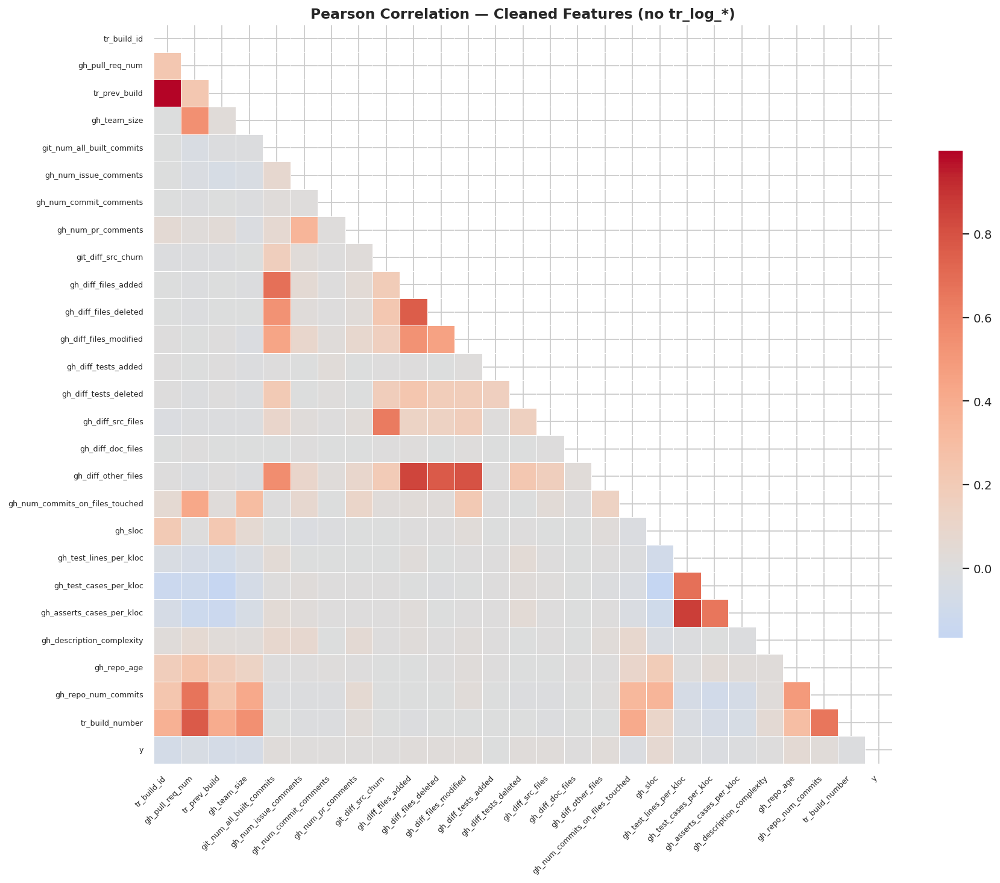
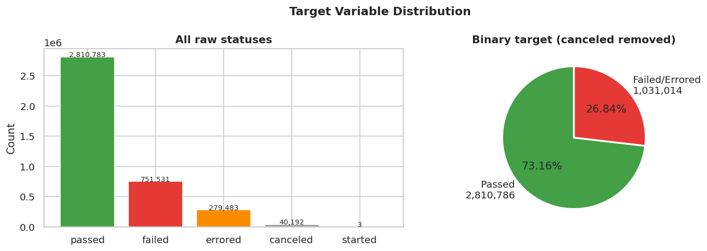
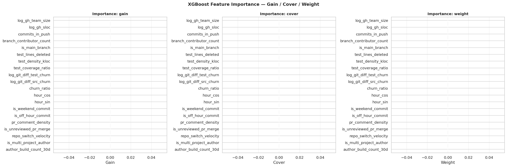
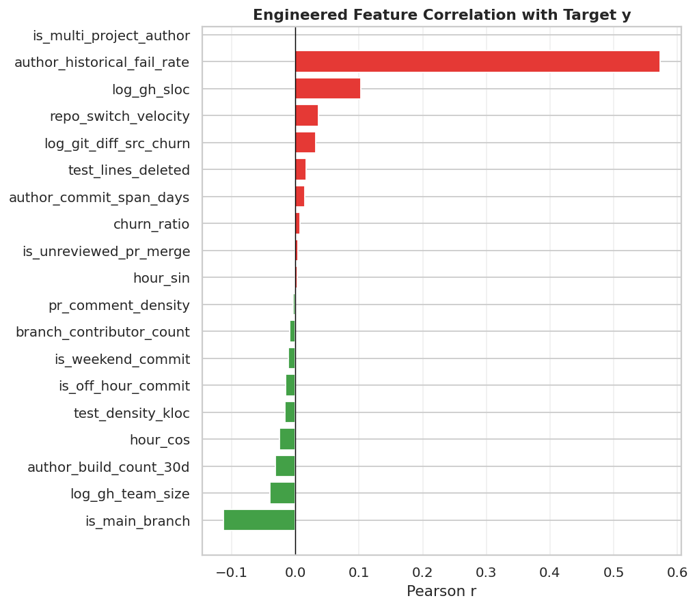
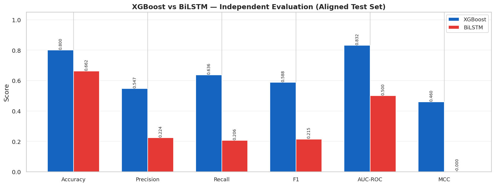
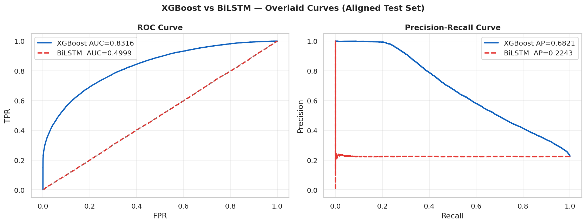
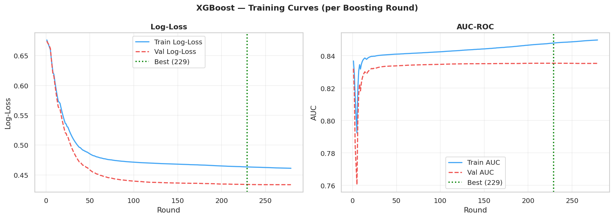
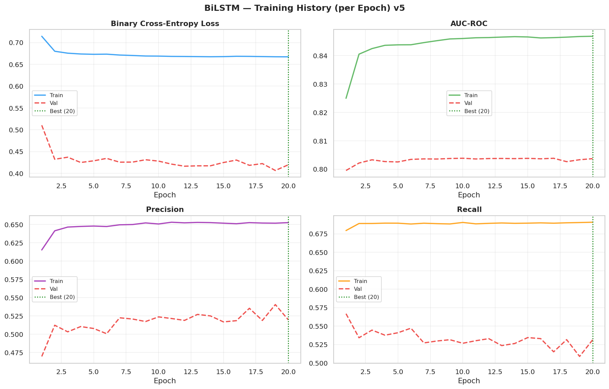

# AIOps Model Training & Analytical Pipeline (`model_training`)

[](../application/api_core)
[](./model_training_script.ipynb)
[](./aiops_xgboost_model.json)
[](./aiops_lstm_model.keras)

This subsystem houses the experimental and analytical workflow for the **AIOps CI/CD Build Failure Risk Prediction Framework**. It encompasses exploratory data analysis (EDA), data cleaning, feature engineering, chronological train/test splitting, hyperparameter tuning, model training for both XGBoost and BiLSTM architectures, comparative evaluation, and artifact serialization.

---

## 📑 Table of Contents
- [Hardware & PC Specifications](#hardware--pc-specifications)
- [Dataset Ingestion & Memory Management](#dataset-ingestion--memory-management)
- [Step-by-Step Execution Walkthrough](#step-by-step-execution-walkthrough)
- [Pipeline Phases & Methodology](#pipeline-phases--methodology)
- [Embedded Training Visualizations](#embedded-training-visualizations)
- [Trained Model Exports & Serialization](#trained-model-exports--serialization)
- [Subsystem Navigation](#subsystem-navigation)

---

## Hardware & PC Specifications

Processing the **TravisTorrent benchmark dataset** (~2.64 million build instances) requires efficient memory management strategies to prevent Out-Of-Memory (OOM) errors.

### Hardware Guidelines
- **Operating System**: Linux (Ubuntu 20.04/22.04 LTS recommended), macOS (12+), or Windows 10/11 (WSL2).
- **System Memory (RAM)**: **16 GB to 32 GB RAM**. The pipeline actively manages memory via `psutil` profiling and enforces a maximum allocation budget of **< 20 GB RAM**.
- **Processor (CPU)**: Multi-core x86_64 CPU (**8+ cores / 16 threads** recommended to accelerate XGBoost parallel tree construction and sequence window generation).
- **GPU Acceleration (Optional)**: CUDA-compatible NVIDIA GPU (4GB+ VRAM) for faster TensorFlow BiLSTM training (CPU execution is fully supported).
- **Storage Space**: At least **10 GB free disk space** (3.5 GB for raw CSV ingestion, 1 GB for temporary checkpoints, and space for rendered HTML/PNG reports).

---

## Dataset Ingestion & Memory Management

### Dataset Description: TravisTorrent
The training process uses the **TravisTorrent Open Mining Dataset** (`final-2017-01-25.csv`), containing ~2,640,000 CI/CD build runs spanning ~1,300 open-source GitHub projects.

- **Primary Features**: 66 raw variables covering repository SLOC, team size, code churn, author experience, PR discussions, and build status.
- **Target Variable**: `tr_status` (`passed` vs `failed`/`errored`; `canceled` entries are excluded).

### Dataset Setup Instructions
1. Obtain `final-2017-01-25.csv` from the official TravisTorrent project archive.
2. Place `final-2017-01-25.csv` inside `model_training/`:
   ```
   model_training/
   ├── final-2017-01-25.csv
   ├── model_training_script.ipynb
   └── ...
   ```

### Memory Optimization Rules
- **Chunked Ingestion**: Loads data in `150,000` row chunks using `pandas.read_csv`.
- **Dtype Downcasting**: Automatically casts `float64` features to `float32` and integer features to their minimal integer representation (`int8`, `int16`, `int32`).
- **Deduplication**: Filters duplicates based on business key `(gh_project_name, gh_build_started_at, git_trigger_commit)`.

---

## Step-by-Step Execution Walkthrough

### 1. Environment Setup
```bash
cd model_training
python3 -m venv venv
source venv/bin/activate  # On Windows: .\venv\Scripts\Activate.ps1
```

### 2. Dependency Installation
```bash
pip install --upgrade pip
pip install xgboost>=2.0 scikit-learn pandas numpy matplotlib seaborn tensorflow>=2.13 psutil joblib jupyter notebook
```

### 3. Launch Notebook
```bash
jupyter notebook model_training_script.ipynb
```
*Or using JupyterLab:*
```bash
jupyter lab
```

### 4. Execute Training Pipeline
In the Jupyter top menu, click **Kernel -> Restart & Run All** to run all 13 phases sequentially.

---

## Pipeline Phases & Methodology

The notebook is divided into 13 structured phases:

1. **Phase 0 — Setup & Environment Configuration**: Initializes random seeds (42) and configures `psutil` RAM monitoring.
2. **Phase 1 — Raw Ingestion**: Stream-loads `final-2017-01-25.csv` in chunks with automatic downcasting.
3. **Phase 2 — Raw Exploratory Analysis**: Inspects column types, missingness, zero-variance columns, and temporal bounds.
4. **Phase 3 — Visual Sampling**: Generates statistical distribution plots on a representative 50,000-row sample.
5. **Phase 4 — Data Preprocessing**: Imputes missing values, encodes categorical variables, and orders records chronologically by project.
6. **Phase 5 — Post-Preprocessing Insights**: Computes correlation heatmaps and temporal distribution shifts.
7. **Phase 6 — Feature Engineering**: Constructs 22 high-impact predictors (churn ratios, historical author failure rates, temporal flags).
8. **Phase 7 — Feature Ranking**: Evaluates feature importance and target correlations.
9. **Phase 8 — Chronological Train/Validation/Test Split**: Executes a 70% Train / 15% Validation / 15% Test chronological split without temporal data leakage.
10. **Phase 9 — XGBoost Model Training**: Trains `XGBClassifier` with `EarlyStopping`, sweeps classification thresholds, and plots ROC/PR curves.
11. **Phase 10 — Sequence Matrix Generation**: Formulates sliding historical build windows ($L=10$) per repository.
12. **Phase 11 — BiLSTM Neural Network Training**: Trains Bidirectional LSTM network with Dropout and BatchNorm layers.
13. **Phase 12 — Head-to-Head Model Evaluation**: Compares single-model performance against the hybrid ensemble.

---

## Embedded Training Visualizations

### 1. Exploratory & Correlation Analysis


*Figure 1: Pearson correlation matrix across cleaned numerical features, illustrating low inter-feature collinearly after preprocessing.*


*Figure 2: Target variable class distribution showing proportion of passed vs failed/errored builds across the dataset.*

---

### 2. Feature Importance & Target Ranking


*Figure 3: Feature importance rankings derived from gain and cover metrics in the trained XGBoost model.*


*Figure 4: Direct correlation ranking between engineered features and build failure status.*

---

### 3. Model Benchmark & Learning Curves


*Figure 5: Comparative metrics across standalone models and the Hybrid Ensemble (Accuracy: 89.1%, ROC-AUC: 0.925).*


*Figure 6: Receiver Operating Characteristic (ROC) and Precision-Recall (PR) curves comparing XGBoost, BiLSTM, and Ensemble predictions.*


*Figure 7: XGBoost log-loss and AUC progression across boosting iterations with Early Stopping.*


*Figure 8: BiLSTM Loss, AUC, Precision, and Recall optimization curves across training epochs.*

---

## Trained Model Exports & Serialization

Upon completion, the notebook saves serialized artifacts to `model_training/` (which are synced to `../application/api_core/` for online REST inference):

- `aiops_xgboost_model.json`: XGBoost tree parameters and split nodes.
- `aiops_lstm_model.keras`: BiLSTM model architecture and learned weight matrices.
- `aiops_lstm_scaler.pkl`: `StandardScaler` normalization parameters.
- `model_training_report.html`: Self-contained HTML report displaying all analysis tables and rendered charts.

---

## Subsystem Navigation

- 🏠 **[Root Project README](../README.md)**: Main system portal, mathematical model descriptions, and project overview.
- 🚀 **[Application Subsystem README](../application/README.md)**: Microservice architecture, API reference, and Docker deployment guide.
- 🧪 **[Sample Test Dataset](../application/sample_test_data.csv)**: 50-row test dataset for local API execution.
